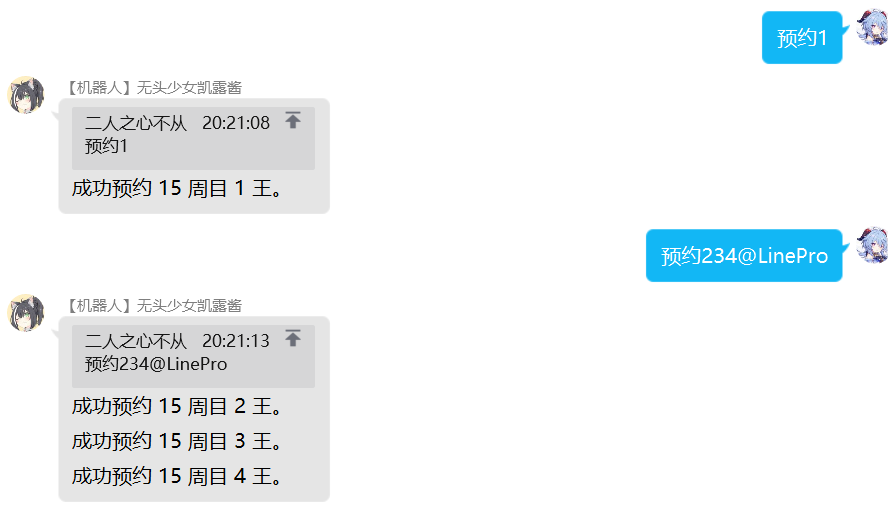

---

title: 会战出刀
# sidebar: auto
---
<!-- <font color="#e60033"></font> -->
# 会战出刀
*说明：部分会战功能,是 **@LinePro** 的机器人的独特功能，与原版的yobot不同。区别部分需要仔细确认*  
*带有 `<>` 的指令，表示该部分<font color="#e60033">必填</font>*  
*而带有 `[]` 的指令，表示里面的内容<font color="#e60033">选填</font>*    

## 系统指令
### 手册
指令：`手册`  
示例：
```
手册  
```


权限：无    
说明：查看公会战使用手册  

***
### 面板
指令：`面板`  
示例：
```
面板  
```


权限：无  
说明：进入公会战面板  
***
### 查刀
指令：`查刀`  
示例：
```
查刀  
```


权限：无  
说明：进入公会战查刀页面  
***

### 创建公会
指令：`创建[国/日/台/韩]服工会`  
示例：
```
创建国服工会
创建日服公会
创建台服工会
创建公会
```
权限：会战管理员   
说明：创建台服工会|日/韩/台/国，创建后可在后台修改。默认创建国服公会。
***
### 加入工会
指令：`加入工会 [@某人]`  
示例：
```
加入工会  
加入公会 @xxx   
```
权限：加入工会无权限，**@加入工会需要 Q 群管理员权限**。    
说明：加入到公会名单。如果有@则为让该玩家加入工会。  

***

### 加入全部成员

指令：`加入全部成员`  
示例：
```
加入全部成员  
```


权限：Q 群管理员  
说明：将群内的所有人加入工会（需要 Q 群管理员才可）

***
## 出刀常用指令
### 报刀
指令：`报刀 <伤害值> [@某人] [昨日] [：备注]`  
示例：
```
报刀 200000   
报刀 30w @xxx ：暴毙法刀
报刀 999k @xxx 昨日 ：昨天给你出的这刀贼强，疯狂暴击  
```


权限：无  
说明：  
1. **对boss造成伤害但<font color="#e60033">未击败</font>时用**，记录伤害，可以使用 200w/200万/2000k 等（一般公会精确到万即可）<b><font color="#e60033">公会中建议使用完整的数字（即第一种报刀）来表示</font></b>。  这样便于确认boss具体血量。  
2. 如果有 @ 则为代报，有冒号则为备注。如果有 `昨日` 则将记录添加到前一天。  
> **昨日功能**：此功能是在日期变更后，将出刀记录添加到前一天。例如国服中 04：59 完成出刀，在 05：01 时向机器人报刀则需要加上 `昨日` （多用于跨日刀）。

***
### 尾刀
指令：`尾刀 [@某人] [昨日] [：备注]`  
示例：
```
尾刀
尾刀 @xxx ：19秒补偿
尾刀 @xxx 昨日：法刀
``` 


<!--   -->

<!--  -->

权限：无  
说明：   
1. **对boss造成伤害并<font color="#e60033">击败</font>时用**，记录伤害。     
2. 如果有 @ 则为代报，有冒号则为备注。如果有 `昨日` 则将记录添加到前一天。  
> **昨日功能**：此功能是在日期变更后，将出刀记录添加到前一天。例如国服中 04：59 完成出刀，在 05：01 时向机器人报刀则需要加上 `昨日` （多用于跨日刀）。 

***
### 掉刀
指令：`掉刀 [@某人] [昨日] [：备注]`
示例：
```
掉刀
掉刀 @xxx ：模拟器闪退
掉刀 @xxx 昨日
```


权限：无
说明：
1. 掉刀时使用，效果等同于 **报刀0**。
2. 如果有 @ 则为代报，有冒号则为备注。如果有 `昨日` 则将记录添加到前一天。
> **昨日功能**：此功能是在日期变更后，将出刀记录添加到前一天。例如国服中 04：59 完成出刀，在 05：01 时向机器人报刀则需要加上 `昨日` （多用于跨日刀）。

***
### sl
指令：`sl [@某人]`  
示例：
```
sl
sl @xxx
```


权限：无    
说明：  
1. 用于记录成员sl。如果成员要sl，务必要先在群上发sl，然后再执行游戏里的sl操作。
2. 若 sl 后面加上 @，则为代报。记录xxx玩家的 SL。 

***

### sl?
指令：`sl? [@某人]`  
示例：
```
sl?    
sl? @xxx   
```

权限：无     
说明：     
1. 用于查询成员是否使用过 sl。     
2. 若 sl 后面加上 @，则为代报。记录xxx玩家的 SL。 
> 在公会战面板的“查刀”页中，可以查看所有人今日是否已使用 SL。

***
### 申请出刀
指令：`申请出刀 [@某人] [：备注]`  
示例：
```
申请出刀
申请出刀 @xxx
```


权限：无    
说明：
1. 提醒他人准备出刀，提醒后面申请出刀的人有人正在挑战 BOSS，他人可从<b style="color：#e60033">状态</b>指令中查看申请出刀的成员。
2. 若加上 @，则视为代刀申请，会自动标注代刀的成员名称。注意需要在备注的冒号前。在冒号后则视为备注内容。
3. 本指令支持 **<font color="#e60033">多人同时申请</font>。**
4. 在状态中，可以看到当前的申请出刀情况。
***

### 挂树
指令：`挂树 [@某人] [：备注]`  
示例：
```
挂树
挂树：妈避
挂树 @xxx :500
```

权限：无  
说明：
1. 玩家挂树，当boss被击败时通知。
2. 若加上 @，则视为代刀挂树，会自动标注代刀的成员名称。注意需要在备注的冒号前。在冒号后则视为备注内容。

***

### 预约
指令：`预约[A/B/C/D]<1/2/3/4/5> [@某人] [：备注]`  
示例：
```
预约1  
预约234  
预约45 @xxx :时停刀
预约D4 @xxx
```



权限：无   
说明：
1. 用于预约boss，当进度推进到当前boss时，机器人会 @ 此人。有冒号则为留言。
2.  **<font color="#e60033">若预约用户未在目标 BOSS 报刀，机器人会自动将此预约延续到下周目。</font>**
3. 若加上 @，则视为代预约，会自动标注代刀的成员名称。
4. 本指令支持批量预约，请参考指令示例。
5. 每天 5:00 机器人会自动清除所有用户的预约。
6. 当用户完成今天的出刀后机器人会自动将该用户的所有预约删除。
***

### 取消预约
指令：`取消预约/取消<1/2/3/4/5> [@某人]`  
示例：
```
取消预约 2   
取消 34
取消预约 12345 @xxx
```
权限：无    
说明：
1. 取消预约<b style="color：#e60033">已预约的最近周目的</b>相关boss。  
2. 若加上 @，则视为代替他人取消预约。
3. 本指令支持批量取消预约，请参考指令示例。
***

### 取消挂树
指令：`取消挂树 [@某人]`  
示例：
```
取消挂树
取消挂树 @xxx
```
权限：无    
说明：
1. 取消挂树状态。
2. 若加上 @，则视为代替他人取消挂树。
***

### 取消申请出刀
指令：`取消申请(出刀) [@某人]`  
示例：
```
取消申请
取消申请出刀 @xxx
```
权限：无    
说明：
1. 取消申请出刀状态。
2. 若加上 @，则视为代替他人取消申请出刀。
***

## 查询指令
### 查询 Boss 预约情况
指令：`查(预约) <1/2/3/4/5>`  
示例：
```
查1   
查 123
查预约345
```


权限：无      
说明：查询该boss的预约情况。本指令支持批量查询，请参考示例。
***
### 查询个人预约情况
指令：`查个人(预约) [@某人]`  
示例：
```
查个人
查个人预约
查个人 @xxx
```


权限：无      
说明：无 @ 时为查询自己的预约情况，有 @ 时为查询对应成员的预约情况。若其后面有括号+id，则表明有人帮他预约了（多用于代刀）
***
### 查树
指令：`查树`  
示例：
```
查树
```


权限：无  
说明：查询当前挂树的成员（有挂树时间统计）。   

***
### 查尾刀
指令：`查尾`  
示例：
```
查尾
```


权限：无  
说明：查询工会尾刀剩余情况。   

***
### 报告
指令：`[离职]报告`  
示例：
```
报告  
```  
  
  

权限：无  
说明：
1. 生成玩家的会战出刀报告。  
2. 总出刀后括号内数字代表包括代刀在内的实际出刀数。漏刀后括号内数字代表被代刀数。
3. 离职报告只是生成图片不同，玩家输入“离职报告”后，不会自动离开工会。

***
### 状态
指令：`状态`  
示例：
```
状态  
```

 

权限：无  
说明：十分重要的指令。**<font color="e60033">用于查询boss状态</font>**、今天的出刀总数以及当前已申请出刀的成员。

***
### 进度/出刀情况
指令：`进度/出刀情况`  
示例：
```
进度
出刀情况
出刀情况at
出刀情况@
进度

```
 
 
 
 
<!-- wx提醒暂时没有了 -->
<!-- 出刀情况wx -->
权限：无  
说明：
1. 用于快捷查询今日的出刀情况，机器人会输出剩余一刀、两刀、三刀未出的人的名单。
2. 标明(尾)字样则说明该成员有未完成的尾刀补偿。
3. 添加at，机器人会在群上同时at这些成员出刀

***

### 查询公会sl情况    
指令：`公会sl`  
示例：
```
公会sl
```
        

权限：无     
说明：用于快捷查询今日的sl使用情况，机器人会输出使用过sl的成员名单。不过只能输入“公会sl”，输入“工会sl”则无法识别。

***
### 统计    
指令：`统计`  
示例：
```
统计
```
        
     
权限：无     
说明：用于查询工会成员的历史出刀统计，包含代刀数，被代刀数，某王出刀数等数据。**此功能为本bot的特色功能**

***

## 合刀
### 合刀指令总览
指令：`合刀`、`超杀合刀`
示例：
```
合刀
超杀合刀
```
 
   

权限：无  
说明：用于查看几种合刀方式的使用方法。
***

### 合刀
指令：`合刀 <boss血量> [刀1伤害] [刀2伤害]`  
示例：
```
合刀 500w
合刀 300w 200w 100w
合刀 300w 200w
合刀 3123546 2698752 2401568 
```
   
   
     
权限：无  
说明：用于计算合刀补偿时间和满补刀伤害计算。
1. 当 `合刀` 关键字后接**三个数字**时，第1个数字表示 boss 血量，后2个数字表示两刀的伤害，将会分别输出两种先后情况下的补时。
2. 当 `合刀` 关键字后接**两个数字**时，第1个数字表示 boss 血量，第2个数字表示刀伤。当 boss 血量小于等于刀伤时计算此刀的预计补时。当 boss 血量大于刀伤时计算合刀时其中一刀获得满补所需的另一刀伤害。
3. 当 `合刀` 关键字后接**一个数字**时，该数字表示 boss 血量，将会输出两刀击杀获得满补所需的伤害值（即满补线）。
***


### 超杀合刀
指令：`超杀合刀 <boss剩余血量> <此刀剩余秒数> <此刀目标补偿秒数>`  
示例：
```
超杀合刀 1200w 56 70
```
     
权限：无  
说明：用于计算超杀合刀（一刀杀）的情况 
1. boss血量：指boss当前剩余血量
2. 此刀剩余秒数：指模拟刀击杀boss后，剩余的秒数。（不包含补偿送的20s）
3. 此刀目标补偿秒数：指有人参与合刀后，最终想要到达的秒数。（用于高补收下一个boss，一穿二等）
***

### 一穿二合刀
指令：`一穿二合刀 <boss血量> <此刀剩余秒数>`  
示例：
```
合刀 500w
合刀 300w 200w 100w
合刀 300w 200w
合刀 3123546 2698752 2401568 
```
      
权限：无  
说明：用于计算一穿二合刀（指一刀杀两次boss）
1. boss血量：指boss当前剩余血量
2. 此刀剩余秒数：指模拟刀击杀boss后，剩余的秒数。（不包含补偿送的20s）
3. 用于计算一刀杀两次boss，需要队友垫的伤害
***
## 排名功能
### 查询排名
指令：`排名 [5]`  
示例：
```
排名
排名5
```    
<!--            -->
   
权限：无       
说明：
1. 查询当前工会的会战排名
2. 有 `5` 时表示查询公会在 5:00 和 5:30 这两个时间点之间的排名。

***
### 设置排名功能
指令：`设置会长 <13位游戏UID>`  
示例：
```
设置会长     
```
 
权限：管理员    
说明：设置工会的会长游戏 uid 后，才能查询工会当前排名。    

***

### 查询档线

指令：`档线 <前中后>排 [5]`  
示例：
```
档线 前排
档线 前中排
档线 前中后排
档线 中排 5
```

  


权限：无    
说明：
1. 用于查询当前的**工会战的各个档位线(这里大致分为前中后三挡)的数据**
2. 其中前排指1-50名的工会，中排指200-2800的工会，后排指5000名以后的工会（此划分方式仅仅是便于程序查询）
3.  如果输入档线前中排，则会同时显示前排和中排的数据，玩家可以根据需求，来进行查询。
4. 如果**在最后额外输入5**，则会查询**当天凌晨五点时的会战排名数据**。

***
## 控制指令
### 撤销
指令：`撤销`  
示例：
```
撤销  
```


权限：会战管理员可以撤销其他人的出刀，非管理员只能撤销自己的出刀。  
说明：  
1. 该功能，用于撤销上一刀的出刀情况（尾刀或报刀）   
2. 若上一刀是自己出的，自己可以撤销。若上一刀不是自己出，但上上刀是，则只能由管理员连续撤销多次。

***

### 锁定
指令：`锁定 [：备注]`  
示例：
```
锁定
锁定 ：等人合刀
```
权限：无    
说明：锁定 boss，提醒后面申请出刀的人，冒号后为留言。
***

### 解锁
指令：`解锁`  
示例：
```
解锁  
```
权限：无  
说明：解锁当前boss，让玩家可以出刀。
> 此功能既可以用于主动结束锁定，也可以用户强制取消他人的解锁。本人或管理员可以随意解锁，“锁定”没有时间限制。
***

