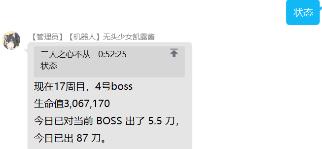

---

title: 会战出刀
# sidebar: auto
---

# 会战出刀
*说明：部分会战功能,是 **@LinePro** 的机器人的独特功能，与原版的yobot不同。区别部分需要仔细确认*  
*带有 `<>` 的指令，表示该部分必填。而带有 `[]` 的指令，表示里面的内容选填*    

## 系统指令
### 手册
指令：`手册`  
示例：
```
手册  
```
权限：无    
说明：查看公会战使用手册  

***
### 面板
指令：`面板`  
示例：
```
面板  
```
权限：无  
说明：进入公会战面板  
***
### 查刀
指令：`查刀`  
示例：
```
查刀  
```
权限：无  
说明：进入公会战查刀页面  
***

### 创造公会(工会)
指令：`创建[国/日/台/韩]服工会`  
示例：
```
创建国服工会
创建日服公会
创建台服工会
创建公会
```
权限：会战管理员   
说明：创建台服工会|日/韩/台/国，创建后可在后台修改。默认创建国服公会。
***
### 加入工会
指令：`加入工会 [@某人]`  
示例：
```
加入工会  
加入公会 @xxx   
```
权限：加入工会无权限，**@加入工会需要 Q 群管理员权限**。    
说明：加入到公会名单。如果有@则为让该玩家加入工会。  

  

***

### 加入全部成员

指令：`加入全部成员`  
示例：
```
加入全部成员  
```
权限：Q 群管理员  
说明：将群内的所有人加入工会（需要 Q 群管理员才可）

***
## 出刀常用指令
### 报刀
指令：`报刀 <伤害值> [@某人] [昨日] [：备注]`  
示例：
```
报刀 200000   
报刀 30w @xxx ：暴毙法刀
报刀 999k @xxx 昨日 ：昨天给你出的这刀贼强，疯狂暴击  
```

<!--  -->

<!--  -->


权限：无  
说明：  
1. 对boss造成伤害但未击败时用，记录伤害，可以使用 200w/200万/2000k 等（一般公会精确到万即可）<b>公会中建议使用完整的数字来表示</b>。  这样查账比较方便。  
2. <b style="color：#e60033">报刀的时候如果需要备注阵容等信息请使用冒号备注的方法，该信息会显示在查刀页面中。 </b>    
3. 如果有 @ 则为代报，有冒号则为备注。如果有 `昨日` 则将记录添加到前一天。  
> **昨日功能**：此功能是在日期变更后，将出刀记录添加到前一天。例如国服中 04：59 完成出刀，在 05：01 时向机器人报刀则需要加上 `昨日` （多用于跨日刀）。

***
### 尾刀
指令：`尾刀 [@某人] [昨日] [：备注]`  
示例：
```
尾刀
尾刀 @xxx ：19秒补偿
尾刀 @xxx 昨日：法刀
``` 

<!--   -->

<!--  -->

权限：无  
说明：   
1. **对boss造成伤害并击败时用**，记录伤害。     
2. <b style="color：#e60033">报刀的时候如果需要备注阵容等信息请使用冒号备注的方法，该信息会显示在查刀页面中。 </b>    
3. 如果有 @ 则为代报，有冒号则为备注。如果有 `昨日` 则将记录添加到前一天。  
> **昨日功能**：此功能是在日期变更后，将出刀记录添加到前一天。例如国服中 04：59 完成出刀，在 05：01 时向机器人报刀则需要加上 `昨日` （多用于跨日刀）。 

***
### sl
指令：`sl [@某人]`  
示例：
```
sl
sl @xxx
```


权限：无    
说明：  
1. 用于记录成员sl。如果成员要sl，务必要先在群上发sl，然后再执行游戏里的sl操作。
2. 若 sl 后面加上 @，则为代报。记录xxx玩家的 SL。 

***

### sl?
指令：`sl? [@某人]`  
示例：
```
sl?    
sl? @xxx   
```
权限：无     
说明：     
1. 用于查询成员是否使用过 sl。     
2. 若 sl 后面加上 @，则为代报。记录xxx玩家的 SL。 
> 在公会战面板的“查刀”页中，可以查看所有人今日是否已使用 SL。

***
### 申请出刀
指令：`申请出刀`  
示例：
```
申请出刀  
```
权限：无    
说明：准备出刀，同时锁定boss，提醒后面申请出刀的人有人正在挑战boss。    
***
### 挂树
指令：`挂树`  
示例：
```
挂树  
```
权限：无  
说明：玩家挂树，当boss被击败时通知。   

***

### 预约
指令：`预约<1/2/3/4/5> [：备注]`  
示例：
```
预约1  
预约2  
```
权限：无   
说明：
1. 用于预约boss，当进度推进到当前boss时，机器人会 @ 此人.有冒号则为留言。
2.  <b style="color：#e60033">若预约用户未在目标 BOSS 出刀时，机器人会自动为此人预约下周目 BOSS。</b> 
***

### 取消预约
指令：`取消预约/取消<1/2/3/4/5>`  
示例：
```
取消预约 2   
取消 3  
```
权限：无    
说明：取消预约<b style="color：#e60033">已预约的最近周目的</b>相关boss。  
***

## 查询指令
### 查询预约情况
指令：`查<1/2/3/4/5>`  
示例：
```
查1   
查2   
```
权限：无      
说明：查询该boss的预约情况。    
***
### 查树
指令：`查树`  
示例：
```
查树
```


权限：无  
说明：查询当前挂树的成员。   

***
### 报告
指令：`报告`  
示例：
```
报告  
```
    

权限：无  
说明：生成玩家的会战出刀报告。  

***
### 状态
指令：`状态`  
示例：
```
状态  
```



权限：无  
说明：用于查询boss状态与今天的出刀总数。

***
### 进度/出刀情况
指令：`进度/出刀情况`  
示例：
```
进度
出刀情况
出刀情况at
出刀情况wx
```
权限：无  
说明：用于快捷查询今日的出刀情况，机器人会输出剩余一刀、两刀、三刀未出的人的名单。

***

### 查询公会sl情况    
指令：`公会sl`  
示例：
```
公会sl
```
        

权限：无     
说明：用于快捷查询今日的sl使用情况，机器人会输出使用过sl的成员名单。不过只能输入“公会sl”，输入“工会sl”则无法识别。

***

### 合刀计算
指令：`合刀 <boss血量> <刀1伤害> [刀2伤害]`  
示例：
```
合刀 300w 200w 100w
合刀 300w 200w
合刀 3123546 2698752 2401568 
```
权限：无  
说明：用于计算合刀补偿时间和满补刀伤害计算。
1. 当 `合刀` 关键字后接三个数字时，第一个数字表示 boss 血量，后两个数字表示两刀的伤害，将会分别输出两种先后情况下的补时。
2. 当 `合刀` 关键字后接两个数字时，第一个数字表示 boss 血量，第二个数字表示刀伤。当 boss 血量小于等于刀伤时计算此刀的预计补时。当 boss 血量大于刀伤时计算合刀时另一刀获得满补所需的时间。
***

## 排名功能
### 查询排名
指令：`排名 [5]`  
示例：
```
排名
排名5
```    
          

权限：无       
说明：
1. 查询当前工会的会战排名（本功能的<b style="color：red">核心功能</b>）
2. 有 `5` 时表示查询公会在 5:00 和 5:30 这两个时间点之间的排名。

***
### 设置排名功能
指令：`设置会长 <13位游戏UID>`  
示例：
```
设置会长     
```
权限：管理员    
说明：设置工会的会长游戏 uid 后，才能查询工会当前排名。    

***

### 查询档线

指令：`档线 [前中后]排 [5]`  
示例：
```
档线 前排
档线 前中排
档线 前中后排
档线 中排 5
```

  


权限：无    
说明：用于查询当前的**工会战的各个档位线的数据**，如果**额外输入5**，则会查询当**天凌晨五点时的会战排名数据**。    

***
## 控制指令
### 撤销
指令：`撤销`  
示例：
```
撤销  
```
权限：会战管理员可以撤销其他人的出刀，非管理员只能撤销自己的出刀。  
说明：  
1. 该功能，用于撤销上一刀的出刀情况（尾刀或报刀）   
2. 若上一刀是自己出的，自己可以撤销。若上一刀不是自己出，但上上刀是，则只能由管理员连续撤销多次。

***

### 锁定
指令：`锁定 [：备注]`  
示例：
```
锁定
锁定 ：等人合刀
```
权限：无    
说明：锁定 boss，提醒后面申请出刀的人，冒号后为留言。
***

### 解锁
指令：`解锁`  
示例：
```
解锁  
```
权限：无  
说明：解锁当前boss，让玩家可以出刀。
> 此功能既可以用于主动结束锁定，也可以用户强制取消他人的解锁。本人或管理员可以随意解锁，3分钟后“出刀”可以被任何人解锁，“锁定”没有时间限制。
***

