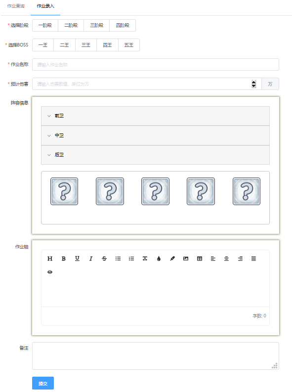
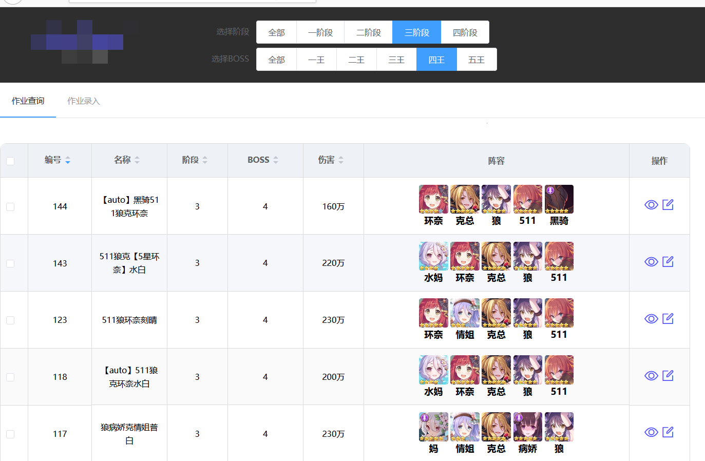
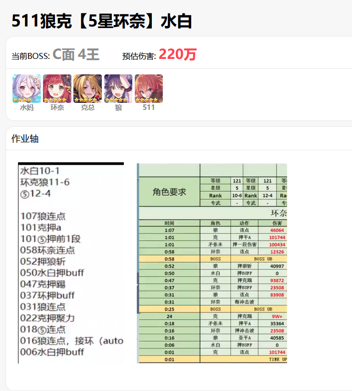
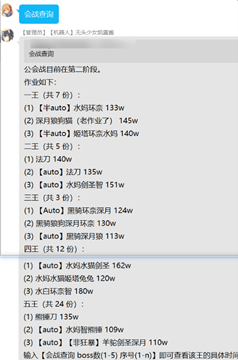
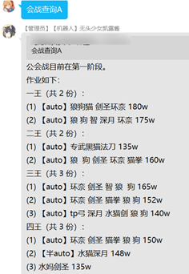
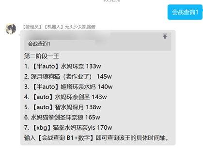
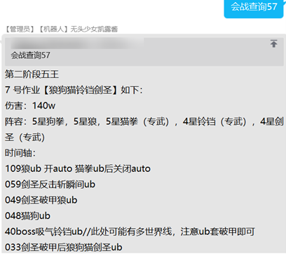

# 会战作业类

## 作业查询
指令:作业查询  
示例：  
1）作业查询  
权限：无    
说明：进入会战作业查询的网页端，在面板中也可以点击“作业查询”进入    
***

## 作业录入
指令:作业录入    
示例：  
1）作业录入    
权限：无    
说明：进入会战作业录入的网页端    
***
### 作业录入说明
进入方法：  
1）在q群输入“作业录入”后，点击机器人发送的网址进入    
2）在“作业查询”界面中，点击上方导航栏里的“作业录入”，也可进入   
录入信息：  
1）阶段：设定该作业的阶段【一二三】     
2）boss：设定该作业对应的boss【12345】    
3）阵容信息：设定本作业的角色信息    
<1>角色头像:设定角色    
<2>星级:设定该角色的星级,可以不填    
<3>专武:设定该角色是否有专武
4）作业名称：设定该作业的名字，最好使用**可读性强的名字**，例如“511狼病刻晴”之类的名字，方便qq上查看     
5）预计伤害：设定该作业的预估伤害，**填入数字即可**，单位为万       
6）作业轴：设定该作业的作业轴，可以复制粘贴图片进来
7）备注：设定补充内容（可以不填，或者填入轴的来源，视频链接等）   
 
 

***

## 会战查询
指令:会战查询+【A/B/C/D】+【12345/一二三四五 】+【作业序号】  
示例：  
1）详情看下方的”会战查询演示“ 

 
权限：无    

说明：用于查询某阶段，某boss的某号作业    

***

### 会战查询演示
基本指令:<b>会战查询+【A/B/C/D】+【12345/一二三四五 】+【作业序号】</b>  
| 关键词                                         |        示例        | 演示图                                                                                                                                                                                                             | 说明                                                                                                                                       |
| :--------------------------------------------- | :----------------: | :----------------------------------------------------------------------------------------------------------------------------------------------------------------------------------------------------------------- | :----------------------------------------------------------------------------------------------------------------------------------------- |
| 会战查询                                       |   会战查询&nbsp;   |                                                                                                                                                        | 用于打印当前阶段，所有boss的作业总数，及展示前3个作业。                                                                                    |
| 会战查询+ boss阶段                          |  会战查询 A&nbsp;  |                                                                                                                                                        | 用于展示 某阶段的boss作业                                                                                                                  |
| 会战查询 +【12345/ 一二三四五】             |  会战查询 1&nbsp;  |                                                                                                                                                        | 用于显示当前阶段，某王的具体作业。 可以会战查询+阶段+王。这样可以查询某阶段的某王的具体作业。如会战查询A3，可以查看第一阶段三王的作业。 |
| 会战查询+【12345/ 一二三四五】 +作业序号 | 会战查询 5 7&nbsp; | <b>先输入会战查询5，查看当前作业清单</b> <b>再输入会战查询 5 7查看五王的7号作业</b>  | <b>本指令，是“会战查询”的核心功能，用于给q群的成员快速查询作业。</b>                                                                       |

