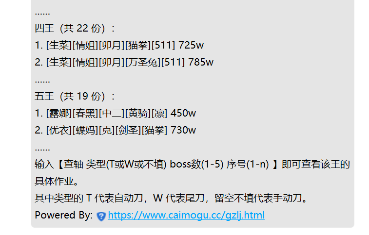
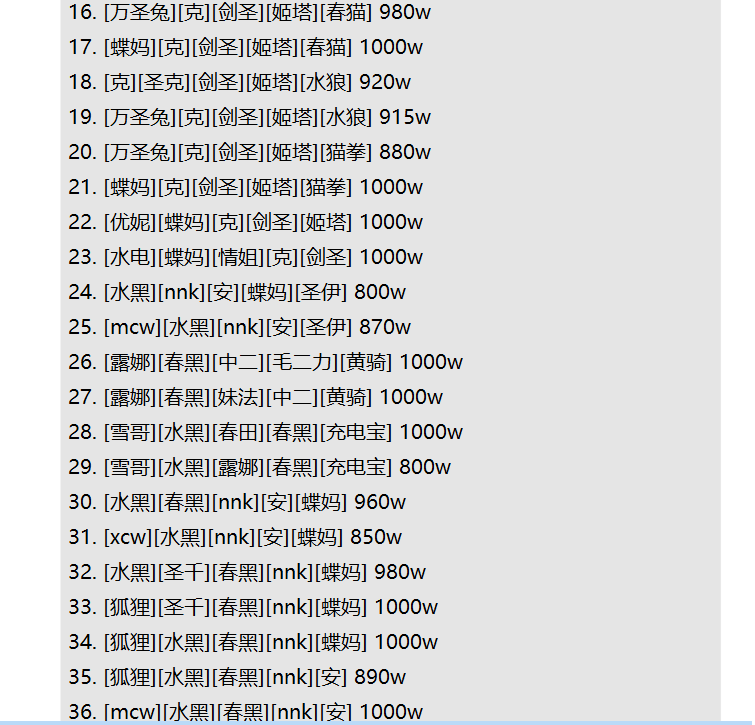

<style>
h1,
h2,
h3,
h4,
h5,
h6 {
    color: #404040;
    line-height: 36px;
}
table th:nth-of-type(1) {
	width: 100px;
}
table th:nth-of-type(2) {
	width: 110px;
}
table th:nth-of-type(3) {
	width: 300px;
}
</style>
# 会战作业类

## 作业查询
指令：`查轴 [A/B/C/D] [T/W] [12345/一二三四五] [作业序号]`  
示例：详情看下方的"查轴演示",以下会有范例演示
```
查轴
查轴 T 3
查轴 T 3 1
查轴 4 1 3
查轴 B 4 5
```
权限：无    
说明：用于查询作业类型，某阶段，某boss的某号作业。    
1. 感谢花舞组的大力支持，作业使用的是花舞组官方提供的作业区。[花舞作业](https://www.caimogu.cc/gzlj.html)
2. `查轴`是基础指令，必须输入，也可以换成`会战查询`
3. T：指`自动刀`  W：指`尾刀` ，若不填则`默认是手动刀`
4. A/B/C/D：指`选择阶段`，A则为A面（1-3周目），B为B面（4-10周目），C为C面（11-34周目），D为D面(35+周目)，如果不加，则会`默认选取当前工会所处阶段`，如工会查询状态时是 15周末1王，则会判断当前阶段为C面。
5. 作业序号：选中对应作业，则可以`查看到该作业详情`（通常需要先查看作业列表，再选择对应的作业）
***

### 查轴演示

|**关键词**|**示例**|**演示图**|**说明**|
|---|---|---| --- |
| **查轴** |`查轴`|  | 用于打印**当前阶段，所有boss的手动刀**的作业总览，及展示前2个作业。|
| **查轴+[T/W]** |`查轴 T`|  | 用于查看**当前阶段，所有boss的自动刀/尾刀**的作业，只展示每个boss的前2个作业。|
| **查轴<br>+boss阶段<br>+[T/W]** | `查轴 a`<br>`查轴a w`| ! | 用于查看**某阶段的所有boss的自动刀/尾刀作业**，只展示每个boss的前2个作业 |
| **查轴 <br>+【12345/<br>一二三四五】**| `查轴 3` |  | **用于显示当前阶段，某王的手动刀作业**。<br>可以查轴+阶段+王。这样可以查询某阶段的某王的作业。如查轴b4，可以查看第二阶段b（b面）四王的作业。 |
| **查轴<br>+[T/W]<br>+【12345/<br>一二三四五】<br>+作业序号** | `查轴 t 5 `<br>*查询当前阶段5王自动刀*<br>`查轴 t 5 7`<br>*查询5王自动刀，7号作业*<br> | **先输入查轴 t 5，查看当前作业清单**<br><b>**<br>再输入会战查询 5 7查看五王的7号作业**</b><br> | 本指令，是 **<font color="#e60033">“会战查询”的核心功能</font>**，用于公会成员快速查询作业。|
| **查轴<br>+boss阶段<br>+[T/W]<br>+【12345/<br>一二三四五】<br>+作业序号** | `查轴 a t 3 2`<br>*查询a面3王自动刀，2号作业* |   | 本指令，是最完整的查轴功能演示。|