# Q 群小游戏（beta版）

## 运势/抽签
指令：`(原神/pcr)抽签/运势`  
示例：
``` 
运势
抽签
原神抽签
```
权限：无  
说明：机器人会根据类别随机发送一个包含运势信息的图片。  

## 游戏列表
指令：`游戏`  
示例：
``` 
游戏
```  
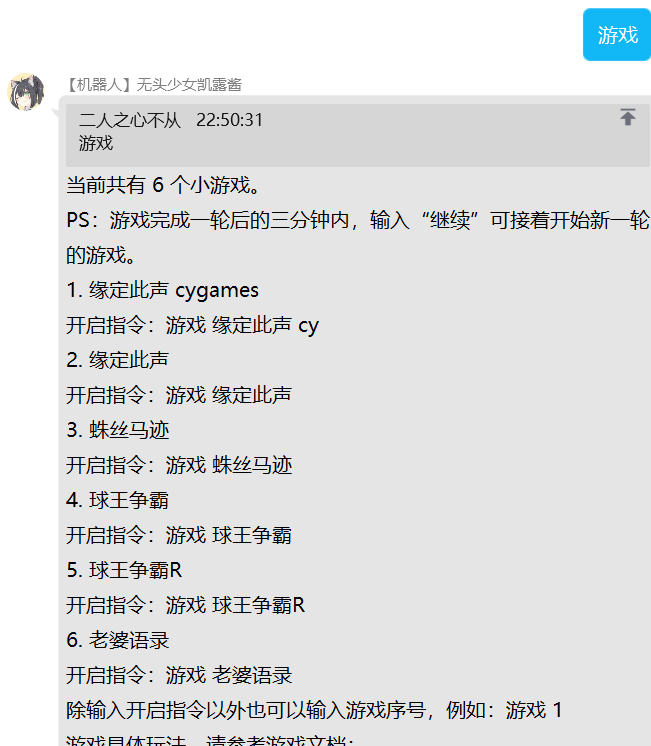

权限：无  
说明：查看当前游戏列表，可以看到游戏的说明

***

### 缘定此声
指令：`游戏 缘定此声`     
示例：  
```
游戏 缘定此声
```  
  

权限：无  
说明：机器人会随机发送一条语音，玩家可借此猜测语音对应角色。      

***

### 缘定此声 cygames
指令：`游戏 缘定此声 cy`    
示例：
```   
游戏 缘定此声 cy
```  
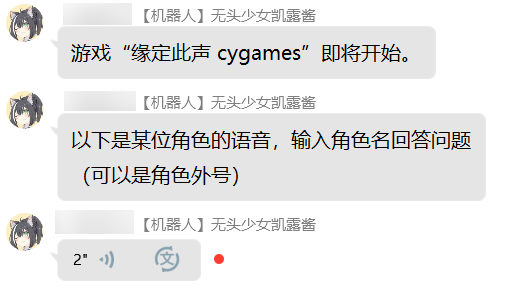    

权限：无  
说明： 机器人会随机发送一条语音（cygames），玩家可借此猜测语音对应角色。  

***

### 蛛丝马迹
指令：`游戏 蛛丝马迹`    
示例：
```  
游戏 蛛丝马迹
```    
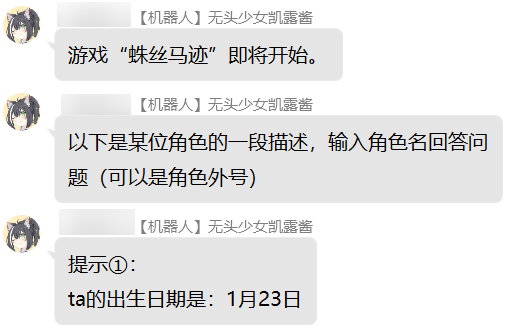    

权限：无  
说明：机器人会发送某位国服角色的小段文字描述，且会定时发送提示【最多发送五次】，直到玩家猜对或游戏时间结束为止，玩家可通过已知的信息猜测是哪位角色。  

***

### 球王争霸
指令：`游戏 球王争霸`    
示例：
```  
游戏 球王争霸
```     
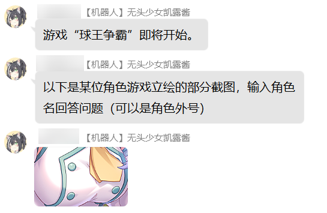   

权限：无    
说明：机器人会随机发送一个角色的胸部的截图，玩家可借此猜测图片对应角色。  

***

### 球王争霸R
指令：`游戏 球王争霸R`      
示例：
```  
游戏 球王争霸R 
```       
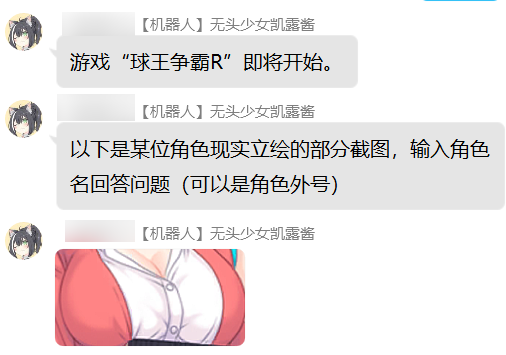    

权限：无  
说明：机器人会随机发送一个角色现实立绘的胸部的截图，玩家可借此猜测图片对应角色。这个模式难度比较大，对游戏角色剧情不熟悉的，不容易猜中  

***

### 老婆语录
指令：`游戏 老婆语录`    
示例：
```  
游戏 老婆语录
```  
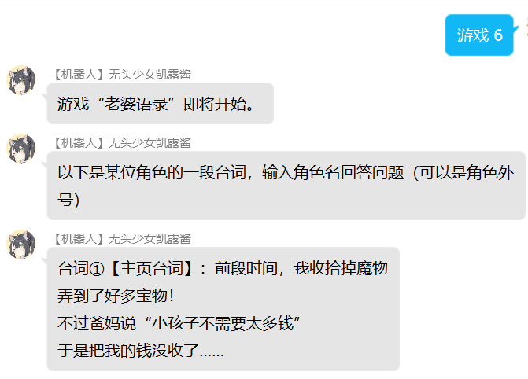  

权限：无    
说明：机器人会发送某位国服角色的部分台词，且会定时发送其他台词【最多发送五次】，直到玩家猜对或游戏时间结束为止，玩家可通过已知的信息猜测是哪位角色。 
***

### 按图索骥
指令：`游戏 按图索骥` 
示例：
```  
游戏 按图索骥
```  
权限：无    
说明：机器人会发送某位角色的头像图片的一角，玩家可以猜该图片对应的是哪个角色，直到玩家猜对或游戏时间结束为止。
***

## 简易计算器
指令：`计算 <算术表达式>`  
示例：
```
计算 3+444+982
计算 98*2+45-32/6
计算 2**2+38-99-(44*2+69)
```   
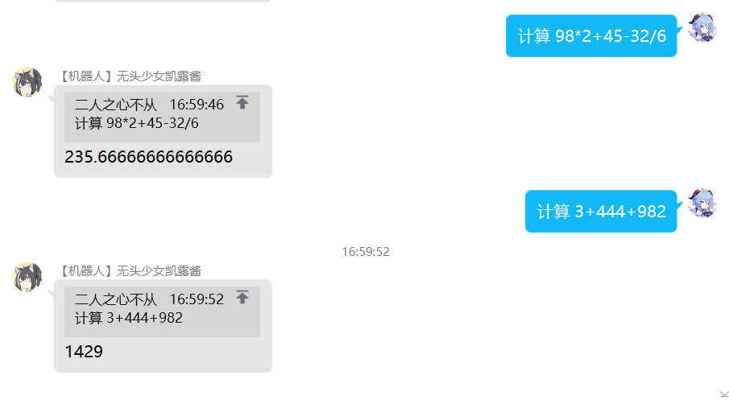
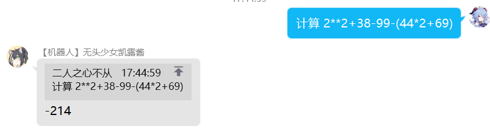
权限：无  
说明：计算式子支持加减乘除，乘方，和括号
***

## 抽签模块
### pcr抽签
指令：`抽签`   
示例：
```  
抽签
```  
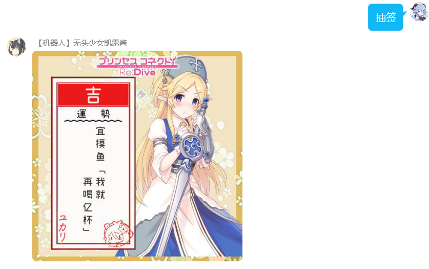
权限：无    
说明：机器人会随机给玩家发一支PCR主题本日幸运签，吉凶未定，富贵不明。
***

### 原神抽签
指令：`原神抽签`   
示例：
```  
原神抽签
```  


权限：无    
说明：机器人会随机给玩家发一支原神主题本日幸运签，吉凶未定，富贵不明。
***


## 问答模块

### 问答录入
指令：`问答录入`  
示例：
```
问答录入
```   
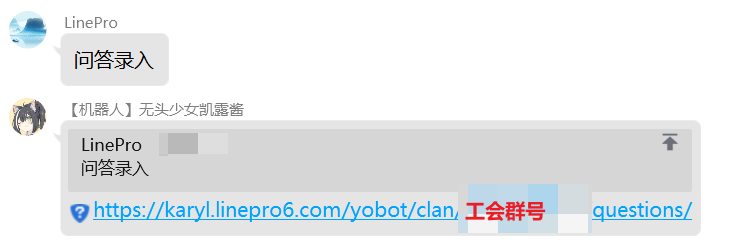
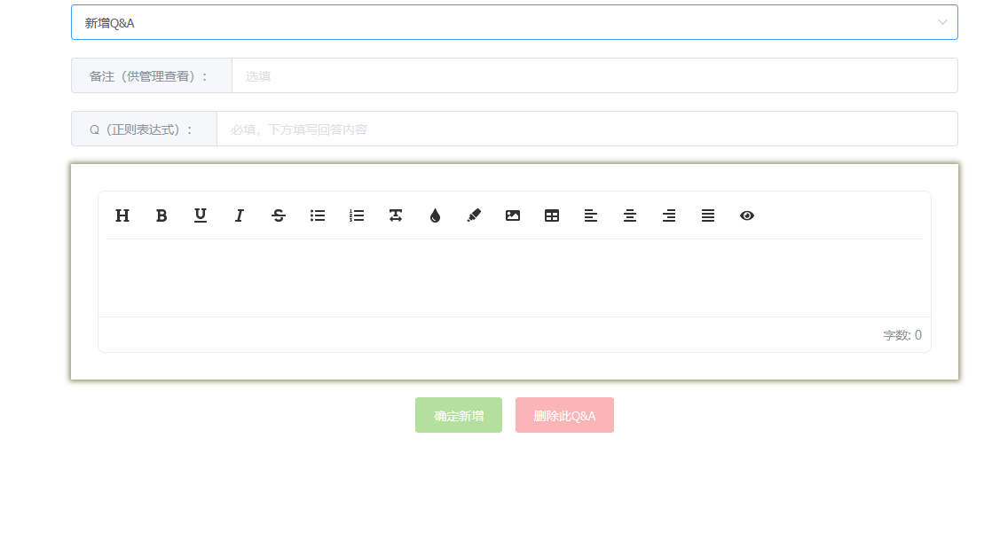
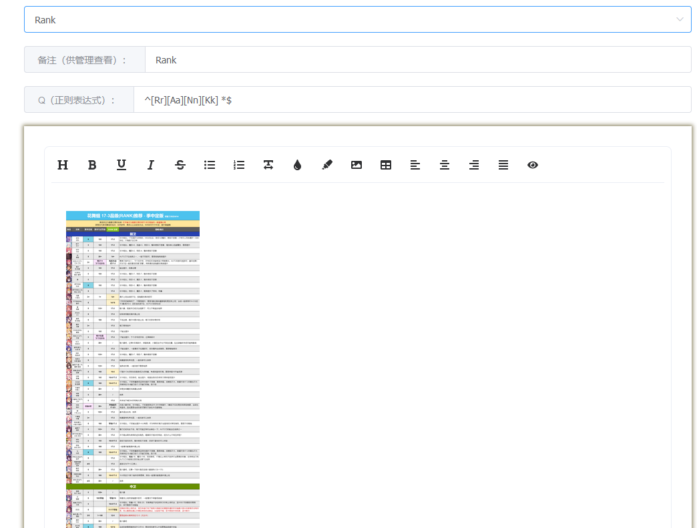
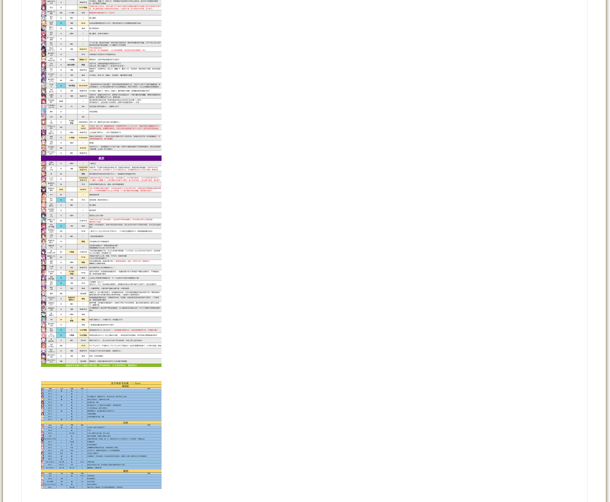
权限：无  
说明：进入问答录入界面。  
1、添加Q&A处，可以新增指令，根据需求自行diy  
2、使用本功能，需要掌握一定的`正则表达式`知识  
3、下方编辑区支持富文本编辑，可以插入图片，文字，链接，也可以更改文字的样式  
***

### rank查询
> **本指令是问答模块下的一个示例**，玩家可以自行添加其他定制指令。
> rank示例图仅为示例，各个工会可以选择自己喜欢的攻略主使用适合的rank表  

指令：`rank`  
示例：
```
rank
```   

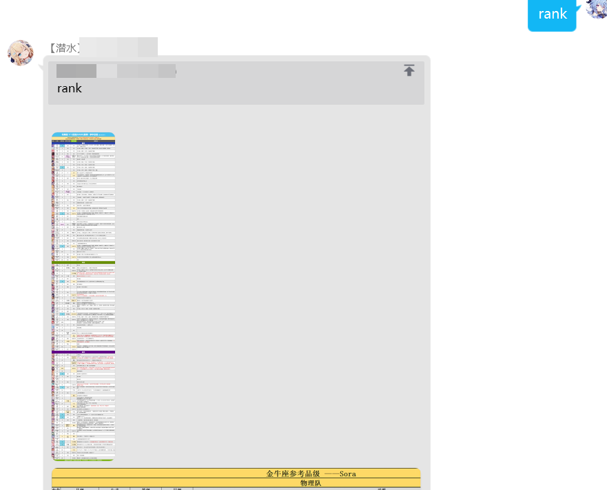
以下是插入的图
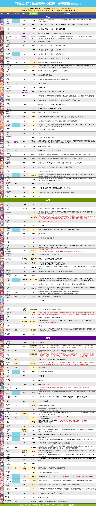
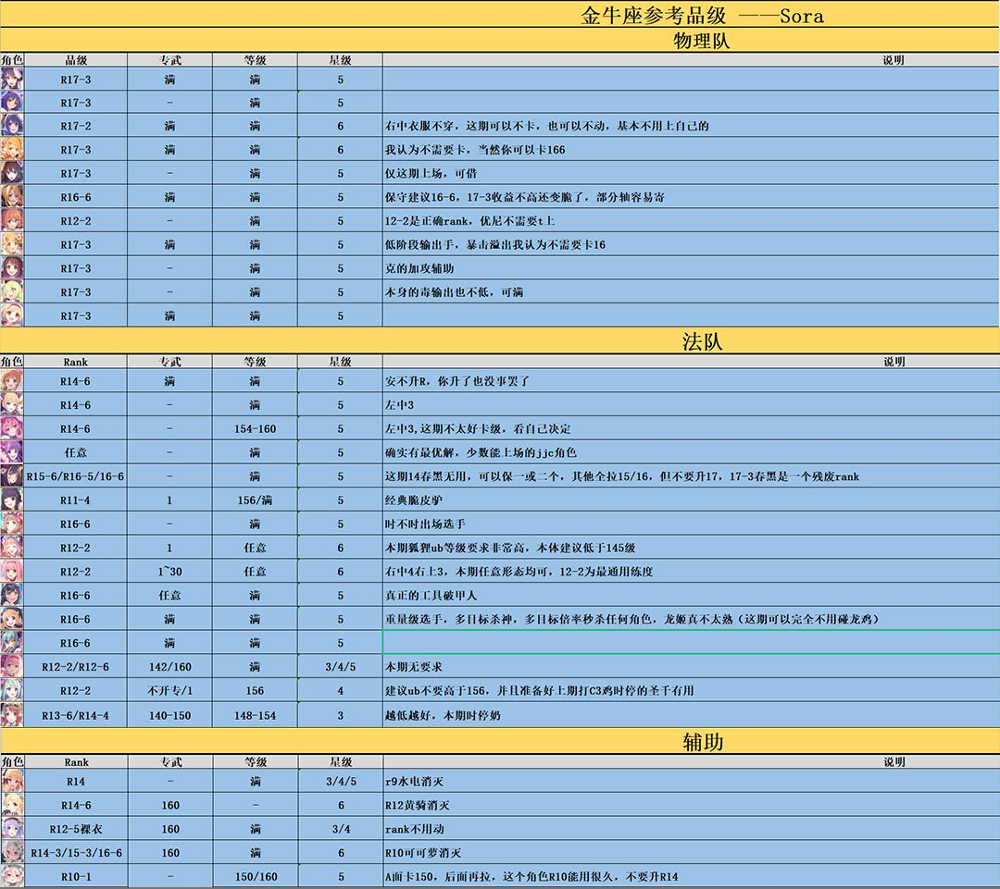

权限：无  
说明：查看pcr的rank表