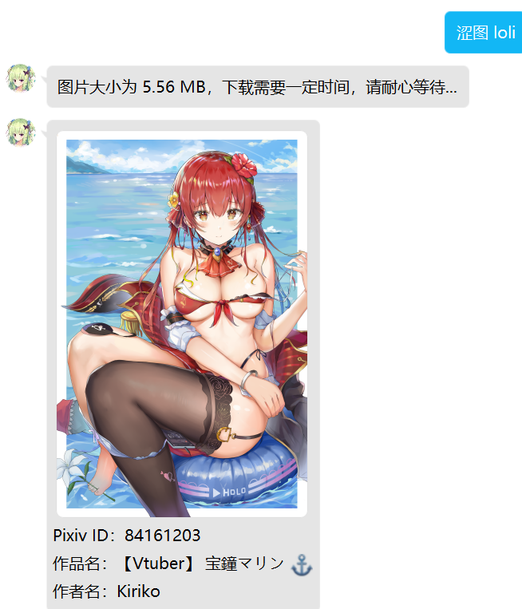
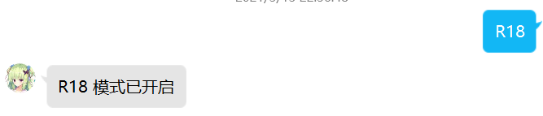

# 看图

## pcr图库[beta版]
### 看图     
指令:我要看涩图/图库+【关键字】     
关键词列表：参考下方的“看图关键词表”   
权限：无      
说明：用于输出pcr主题的图片       
***

### 看图关键词表
关键词 | 关键词列表|示例 | 说明
:-----|:----|:----|:----
 关键字找图|主关键字：我要看涩图 <b>(1)	佩可、吃货、佩可莉姆 (2)	凯露、黑猫、臭鼬 (3)	xcw、镜华、小仓唯 (4)	御三家 (5)	栞、tp弓 (6)	妈、可可萝 (7) 优妮、仙贝、优妮前辈</b> |1）我要看涩图 妈 2）图库 xcw 3）我要看涩图 tp弓 |用于输出指定关键词的pcr同人图。  目前只支持所示的六种关键词，提供素材可以联系@二人之心不从。
 好图|主关键字：我要看涩图 <b>(1)好图</b>|1）	我要看涩图 好图 2）	图库 好图|用于随机输出一张pcr同人图。
 头像|主关键字：我要看涩图 头像 <b>(1)2、2星、二星 (2)3、3星、三星 (3)6、6星、六星 (4)3星站位、三星站位</b>|1）我要看涩图 头像 2）我要看涩图 头像 二星 3）图库 头像 6|用于输出官方的pcr角色头像。根据后面的词缀，可以选择是2,3,6星的图
 表情包|主关键字：我要看涩图 表情包 <b>(1)gif、GIF、动图 (2)小仓唯、xcw、镜华 (3)布丁、宫子、幽灵 (4)抽卡、扭蛋、十连 (5)常用、日常、吊图 (6)凯露、凯留、黑猫 (7)会战、工会战、公会战</b>|1）我要看涩图 表情包 2）我要看涩图 表情包 布丁 3）图库 表情包 xcw 4）图库 表情包 吊图 |用于输出民间创作的表情包，加入关键词，可以使用对应种类的表情包。
 立绘|主关键字：我要看涩图 立绘<b> (1)2、2星、二星 (2)3、3星、三星 (3)6、6星、六星 (4)破衣、破</b> |1）我要看涩图 立绘 2）我要看涩图 立绘 二星 3）图库 立绘 破衣 |用于输出官方的pcr立绘图，后面加关键字，则可以筛选要2、3、6星、破衣的立绘。
 漫画|主关键字：我要看涩图 漫画 <b>(1)xcw、镜华、小仓唯 (2)买套、套 (3)四格 (4)过场、loading、加载</b>|1）我要看涩图 漫画 2）我要看涩图 漫画 xcw 3）图库 漫画 买套  |用于输出一些民间创作的同人漫画图。 若不加关键词，则会随机输出一张图。
 其他|主关键字:我要看涩图 其他 <b>(1)其他</b>|1）	我要看涩图 其他 2）	图库 其他 |用于输出一些未归类的图片。
 宿舍|主关键字:我要看涩图 宿舍 <b>(1)宿舍</b>|1）	我要看涩图 宿舍 2）	图库 宿舍 |用于输出一些精美的宿舍装修图

***
## 涩图
<b class="blue">API接口:lolicon.app  </b>

### 普通涩图
指令:涩图+【关键字】 

     
权限：无      
说明：用于输出接口的图片  

### 特殊涩图
指令:R18涩图+【关键字】     
权限：需要开启R18之后才可使用该指令。    
说明：用于输出接口的涩图（默认附带R18关键字）

### 特殊涩图开启指令
指令:R18  

权限：涩图管理员/机器人主人      
说明：用于设置是否开启特殊涩图接口  

***
