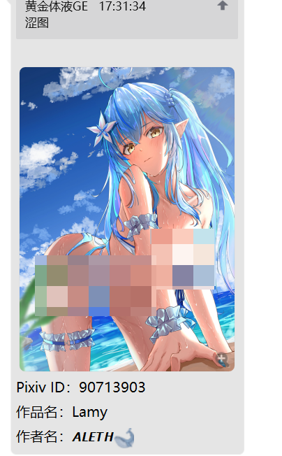
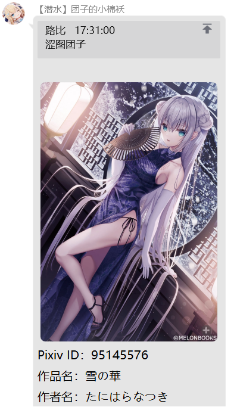
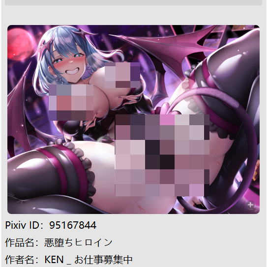
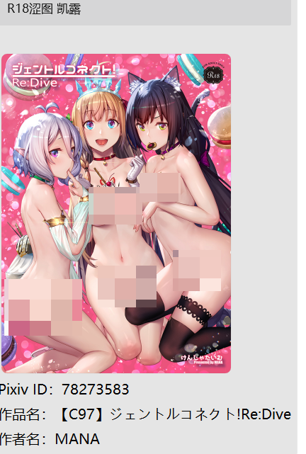
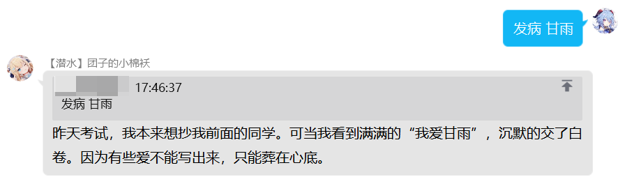

# 附加额外功能
::: tip

本部分功能将使用由服务购买公会提供的 QQ 账号。
大多数功能，添加机器人好友后，都会开放私聊功能。  
因更新频繁，**这里所描述的功能可能与正在运行的最新版本有差别（帮助文档更新有延迟）。**
:::

## 帮助
指令：`帮助`  
示例：
```
帮助
```   


权限：无  
说明：查看表情包扩展模块的使用方法

## 涩图模块

> 本服务使用 [Lolicon API](https://api.lolicon.app/) 接口
### 启用/禁用涩图
指令： `启用/禁用 涩图`   
权限：涩图管理员/机器人主人  
示例：  
```
启用 涩图  
禁用 涩图  
```   
     
说明：用于禁用/启用 涩图功能。 

***
### 启用/禁用R18涩图
指令： `启用/禁用 R18涩图`  
权限：涩图管理员/机器人主人    
示例：  
```
启用 R18涩图  
禁用 R18涩图  
```      
说明：用于禁用/启用 R18涩图功能。如果涩图被禁用了，r18涩图也无法使用。

***
### 普通涩图
指令： `涩图 [关键字]` 
权限：无  
示例：  
```
启用 涩图  
禁用 涩图   
```   
**由于图片比较劲爆，本文档均做打码处理**  

  
权限：无       
说明：根据关键字或随机获取一张涩图。   

***

### 特殊涩图
指令：`R18涩图 [关键字]`    
权限：无（需要管理员开启后才可使用，否则视为普通涩图）    
示例：  
```
R18涩图    
R18涩图 凯露  
```
**由于图片比较劲爆，本文档均做打码处理**   
  
       
说明：根据关键字或随机获取一张 R18 特殊涩图。
***

## 竞技场模块
> 注意：本模块仅限 **私聊** 使用。
### 竞技场绑定
指令：`竞技场绑定 <13位游戏UID>`  
示例：
```
竞技场绑定 1234567890123
```   
权限：无  
说明：双场提醒角色绑定，需要先添加机器人为好友。  

***

### 竞技场绑定
指令：`竞技场查询 [13位游戏UID]`  
示例：
```
竞技场查询
竞技场查询 1234567890123
```   
权限：无  
说明：后不接内容表示查询绑定角色信息，接 13 位游戏 UID 表示查询对应角色的双场信息。 

***

### 竞技场解绑
指令：`竞技场解绑`  
示例：
```
竞技场解绑
```   
权限：无  
说明：解绑 **所有** 的双场提醒角色。
***
## 表情包模块
> 部分功能来自于nonebot2插件商店
> [动作表情包](https://github.com/noneplugin/nonebot-plugin-petpet)
> [诺基亚](https://github.com/noneplugin/nonebot-plugin-memes)
> [发病](https://github.com/noneplugin/nonebot-plugin-asoulcnki)
### 动作表情包
指令：  
&nbsp;&nbsp;静态图：`<撕/丢/爬/精神支柱 ><qq/@xxx/自己/图片>`   
&nbsp;&nbsp;gif：   `<亲/贴/顶 ><qq/@xxx/自己/图片>`   
示例：
```
摸@linepro
丢自己
亲1393844304
```
  
以下是实际使用的**gif图**  


权限：无  
说明：选择行为和对象后，就可以使用对应表情包了。其中`亲/贴`中有两个图片，默认为行为发起人，输入的对象为行为接收人。
***
### 诺基亚
指令：`诺基亚 <自定义文案>`  
示例：
```
诺基亚 好想做甘雨的丝袜
```   

权限：无  
说明：使用诺基亚手机短信的形式做成表情包。
***
### 其他表情包
指令：`表情包`  
示例：
```
表情包
```   


权限：无  
说明：定制各类表情包，请各位自行摸索。
***


## 发病模块

### 启用/禁用发病
指令：`<启用/禁用>发病`  
示例：
```
启用发病
禁用发病
```   


权限：无  
说明：启用/禁用发病模块
***

### 发病
指令：`发病 <对象>`  
示例：
```
发病 凯露
发病 甘雨
```   


权限：无  
说明：其中发病的文案是随机的，输入时，写一个“对象”即可
***


