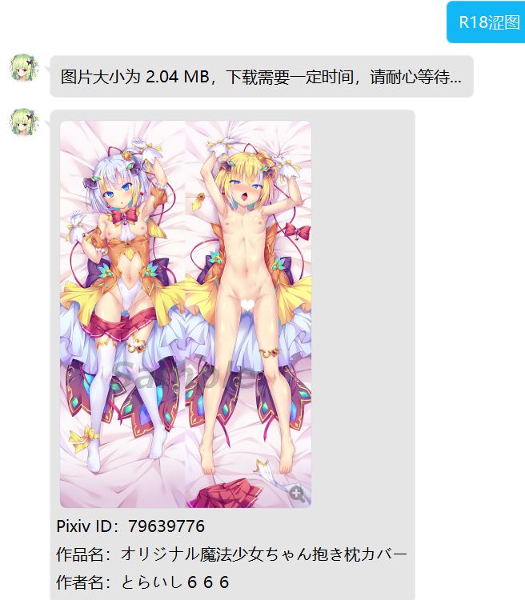

# 附加额外功能
::: tip

本部分功能将使用由服务购买公会提供的 QQ 账号。
因更新频繁，这里所描述的功能可能与正在运行的最新版本有差别。

:::

## 涩图模块

> 本服务使用 [Lolicon API](https://api.lolicon.app/) 接口

### 普通涩图
指令： `涩图 [关键字]` 

     
权限：无      
说明：根据关键字或随机获取一张涩图。  

***

### 特殊涩图
指令：`R18涩图 [关键字]`    
权限：需要开启 `R18 总开关` 之后才可使用该指令。    
说明：根据关键字或随机获取一张 R18 特殊涩图。



***

### 特殊涩图开启指令
指令：`R18`  


权限：涩图管理员/机器人主人      
说明：用于设置是否开启 R18 特殊涩图总开关。  

***

## 竞技场模块
> 注意：本模块仅限 **私聊** 使用。
### 竞技场绑定
指令：`竞技场绑定 <13位游戏UID>`  
示例：
```
竞技场绑定 1234567890123
```   
权限：无  
说明：双场提醒角色绑定，需要先添加机器人为好友。  

***

### 竞技场绑定
指令：`竞技场查询 [13位游戏UID]`  
示例：
```
竞技场查询
竞技场查询 1234567890123
```   
权限：无  
说明：后不接内容表示查询绑定角色信息，接 13 位游戏 UID 表示查询对应角色的双场信息。 

***

### 竞技场解绑
指令：`竞技场解绑`  
示例：
```
竞技场解绑
```   
权限：无  
说明：解绑 **所有** 的双场提醒角色。