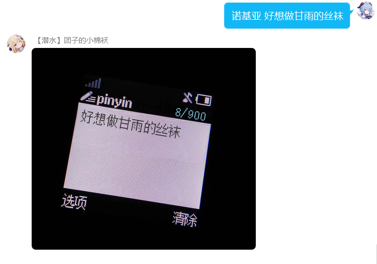
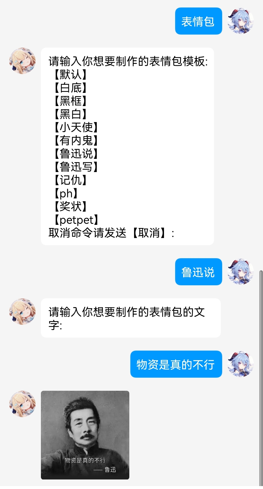
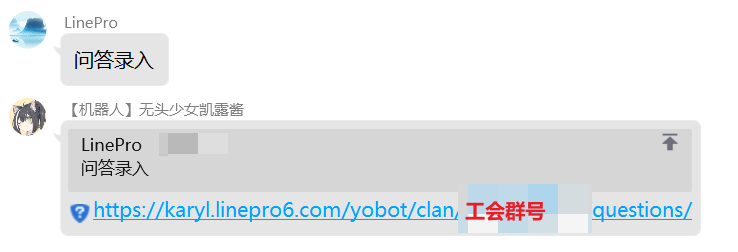
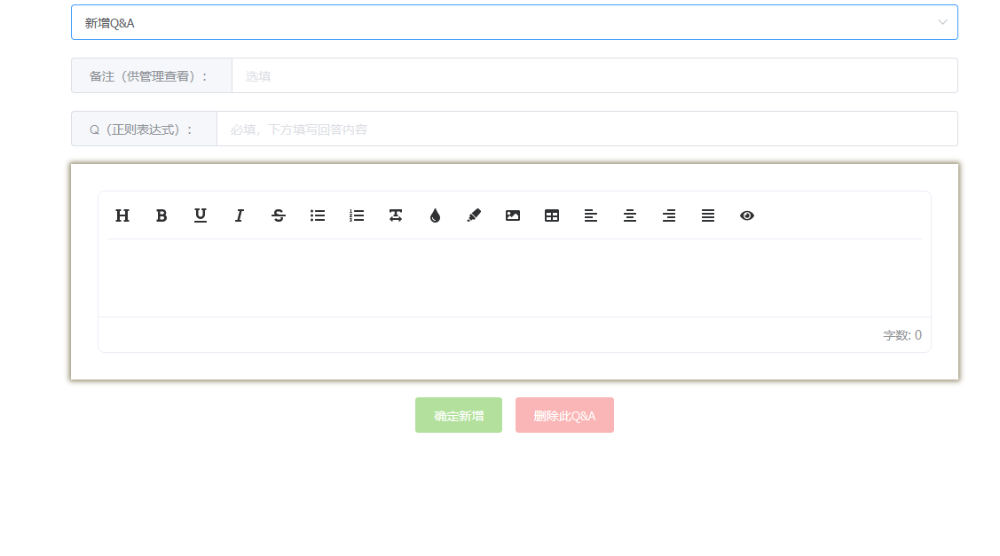
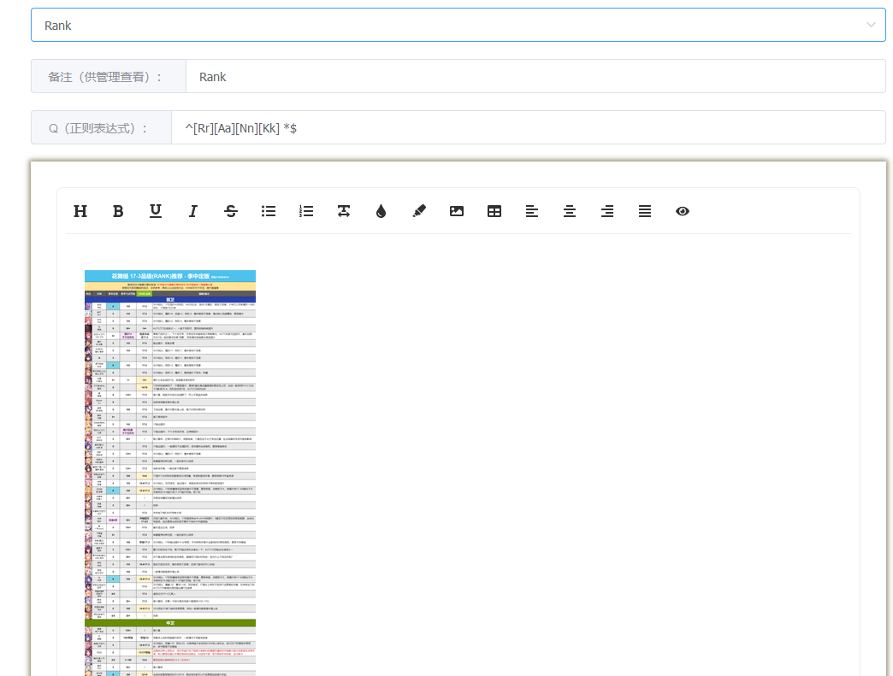

# 附加额外功能
::: tip

本部分功能将使用由服务购买公会提供的 QQ 账号。
大多数功能，添加机器人好友后，都会开放私聊功能。  
因更新频繁，**这里所描述的功能可能与正在运行的最新版本有差别（帮助文档更新有延迟）。**
:::
<!-- rank功能用的是乔斯测试 -->
<!-- 
## rank/品级查询
> rank部分暂时是使用花舞组和sora提供的rank。
指令：`rank`  
示例：
```
rank
```   


权限：无  
说明：查看pcr国服最新的角色品级推荐。（更新时间有一定延迟） -->


## 帮助
指令：`帮助`  
示例：
```
帮助
```   


权限：无  
说明：查看表情包扩展模块的使用方法

## 涩图模块

> 本服务使用 [Lolicon API](https://api.lolicon.app/) 接口

### 普通涩图
指令： `涩图 [关键字]` 

     
权限：无      
说明：根据关键字或随机获取一张涩图。  

***

### 特殊涩图
指令：`R18涩图 [关键字]`    
权限：需要开启 `R18 总开关` 之后才可使用该指令。    
说明：根据关键字或随机获取一张 R18 特殊涩图。


权限：涩图管理员/机器人主人      
说明：用于设置是否开启 R18 特殊涩图总开关。  

***

## 竞技场模块
> 注意：本模块仅限 **私聊** 使用。
### 竞技场绑定
指令：`竞技场绑定 <13位游戏UID>`  
示例：
```
竞技场绑定 1234567890123
```   
权限：无  
说明：双场提醒角色绑定，需要先添加机器人为好友。  

***

### 竞技场绑定
指令：`竞技场查询 [13位游戏UID]`  
示例：
```
竞技场查询
竞技场查询 1234567890123
```   
权限：无  
说明：后不接内容表示查询绑定角色信息，接 13 位游戏 UID 表示查询对应角色的双场信息。 

***

### 竞技场解绑
指令：`竞技场解绑`  
示例：
```
竞技场解绑
```   
权限：无  
说明：解绑 **所有** 的双场提醒角色。
***
## 表情包模块
> 部分功能来自于nonebot2插件商店
> [动作表情包](https://github.com/noneplugin/nonebot-plugin-petpet)
> [诺基亚](https://github.com/noneplugin/nonebot-plugin-memes)
> [发病](https://github.com/noneplugin/nonebot-plugin-asoulcnki)
### 动作表情包
指令：  
&nbsp;&nbsp;静态图：`<撕/丢/爬/精神支柱 ><qq/@xxx/自己/图片>`   
&nbsp;&nbsp;gif：   `<亲/贴/顶 ><qq/@xxx/自己/图片>`   
示例：
```
摸@linepro
丢自己
亲1393844304
```


权限：无  
说明：选择行为和对象后，就可以使用对应表情包了。其中`亲/贴`中有两个图片，默认为行为发起人，输入的对象为行为接收人。
***
### 诺基亚
指令：`诺基亚 <自定义文案>`  
示例：
```
诺基亚 好想做甘雨的丝袜
```   

权限：无  
说明：使用诺基亚手机短信的形式做成表情包。
***
### 其他表情包
指令：`表情包`  
示例：
```
表情包
```   



权限：无  
说明：定制各类表情包，请各位自行摸索。
***


## 发病模块

### 启用/禁用发病
指令：`<启用/禁用>发病`  
示例：
```
启用发病
禁用发病
```   


权限：无  
说明：启用/禁用发病模块
***

### 发病
指令：`发病 <对象>`  
示例：
```
发病 凯露
发病 甘雨
```   


权限：无  
说明：其中发病的文案是随机的，输入时，写一个“对象”即可
***


## 问答模块

### 问答录入
指令：`问答录入`  
示例：
```
问答录入
```   




权限：无  
说明：进入问答录入界面。
1、添加Q&A处，可以新增指令，根据需求自行diy
2、使用本功能，需要掌握一定的`正则表达式`知识
3、下方编辑区支持富文本编辑，可以插入图片，文字，链接，也可以更改文字的样式
***

### rank查询
> **本指令是问答模块下的一个示例**，玩家可以自行添加其他定制指令。
> rank示例图仅为示例，各个工会可以选择自己喜欢的攻略主使用适合的rank表  

指令：`rank`  
示例：
```
rank
```   


以下是插入的图


权限：无  
说明：查看pcr的rank表