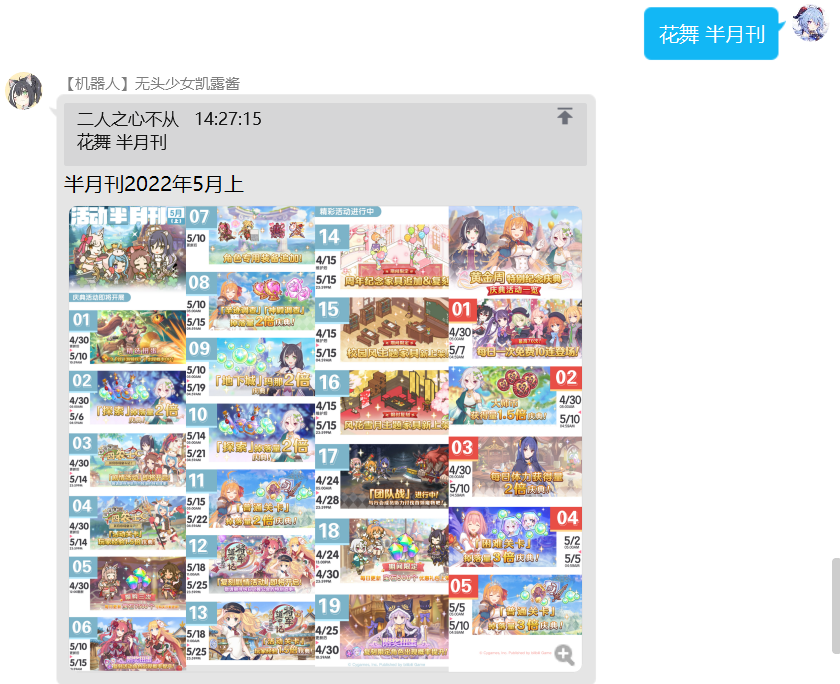
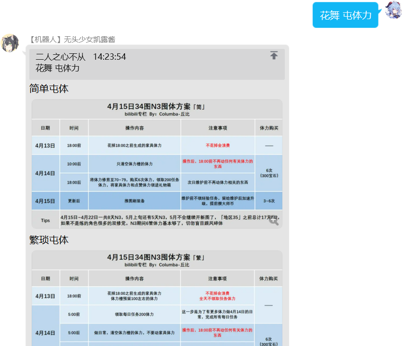
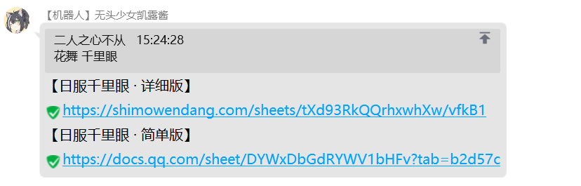
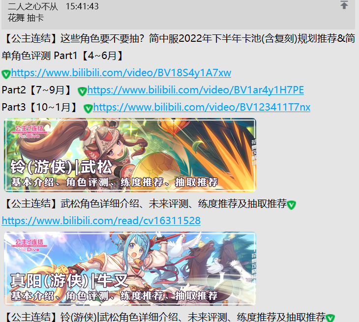

---

title: 花舞指令
# sidebar: auto
---

# 花舞指令

::: tip

本模块的功能，都由花舞组提供。（我方bot在帮助文档更新上，会有一定延迟）  
在花舞给我们的指令清单中，大致整理为三类：  
1、实时攻略类  
2、千里眼/数据类  
3、其他  
其中深空之眼部分的内容，我们暂时不予暂时。详情查看`花舞 帮助`指令
:::
## 帮助
指令：`花舞 帮助`  
示例：
```
花舞 帮助 
```
当前可提供的攻略内容如下：
1: 测试  
2: rank表  
3: 专武  
4: 万用表  
5: 帮助  
6: 千里眼  
7: 半月刊  
8: 图书馆  
9: 日程表  
10: 屯体力  
11: 面试群  
12: 露娜塔  
13: 刷图推荐  
14: 活动攻略  
15: 地下城  
16: 考古表  
17: 六星  
18: 家具  
19: 实时攻略  
20: 霸瞳活动  
21: 指南  
22: 抽卡  
23: 自走棋  
24: 深空之眼梯度榜  
25: 刻印  
26: 神格  
27: 深空之眼杂谈  
28: 因果观测  
29: 角色教学  

权限：无  
说明：可以查看花舞组的指令清单 

## 实时攻略类
>  本大类包含各种实时攻略的查询方法，无论是rank还是刷图攻略，都在这一类中
### 万用表
指令：`花舞 万用表`  
示例：
```
花舞 万用表  
```
 
权限：无  
说明：可以查看花舞组的万用表链接 

***
### rank表
指令：`花舞 rank`  
示例：
```
花舞 rank    
```
 
权限：无   
说明：可以查看花舞组的rank表     

***
### 半月刊
指令：`花舞 半月刊`  
示例：
```
花舞 半月刊   
```
 
权限：无   
说明：可以查看花舞组的半月刊图片    

***
### 露娜塔
指令：`花舞 露娜塔`  
示例：
```
花舞 露娜塔    
```
 
权限：无     
说明：可以查看花舞组的露娜塔攻略    

***
### 刷图推荐
指令：`花舞 刷图(推荐)`  
示例：
```
花舞 刷图推荐
花舞 刷图  
```
 
权限：无   
说明：可以查看花舞组的刷图推荐攻略  

***
### 活动攻略
指令：`花舞 活动(攻略)`  
示例：
```
花舞 活动  
花舞 活动攻略   
```
 
权限：无   
说明：可以查看花舞组的活动攻略  

***
### 实时攻略
指令：`花舞 实时攻略`  
示例：
```
花舞 实时攻略    
```
 
权限：无   
说明：可以查看花舞组的实时攻略链接   

***
### 屯体力
指令：`花舞 体力/囤体`  
示例：
```
花舞 体力    
花舞 囤体   
花舞 囤体力   
花舞 屯体    
花舞 屯体力   
```
 
权限：无   
说明：可以查看花舞组的囤体力攻略 

***

## 千里眼/数据类

### 专武
指令：`花舞 专武`  
示例：
```
花舞 专武      
```
 
权限：无   
说明：查看花舞专武的攻略

***
### 千里眼
指令：`花舞 千里眼`  
示例：
```
花舞 千里眼      
```
 
权限：无   
说明：查看花舞千里眼的攻略

***
### 六星
指令：`花舞 六星`  
示例：
```
花舞 六星      
```
 
权限：无   
说明：查看花舞六星的攻略

***
### 抽卡
指令：`花舞 抽卡`  
示例：
```
花舞 抽卡      
```
 
权限：无   
说明：查看花舞卡池的攻略

***
### 图书馆
指令：`花舞 图书馆`  
示例：
```
花舞 图书馆      
```
 
权限：无   
说明：查看花舞图书馆的链接

***
### 日程表
指令：`花舞 日程表`  
示例：
```
花舞 日程表      
```
 
权限：无   
说明：查看花舞日程表

***
### 家具
指令：`花舞 家具`  
示例：
```
花舞 家具      
```
 
权限：无   
说明：查看花舞家具的攻略

***
### 考古表
指令：`花舞 专武`  
示例：
```
花舞 专武      
```
 
权限：无   
说明：查看花舞专武的攻略

***
### 地下城
指令：`花舞 地下城`  
示例：
```
花舞 地下城      
```
 
权限：无   
说明：查看花舞地下城的攻略

***

## 其他

### 面试群
指令：`花舞 面试群`  
示例：
```
花舞 面试群      
```
 
权限：无   
说明：查看花舞组面试群的联系方式

***
### 霸瞳活动
指令：`花舞 霸瞳`  
示例：
```
花舞 霸瞳     
```
 
权限：无   
说明：查看花舞霸瞳的攻略

***
### 自走棋
指令：`花舞 自走棋`  
示例：
```
花舞 自走棋      
```
 
权限：无   
说明：查看花舞自走棋的攻略

***


