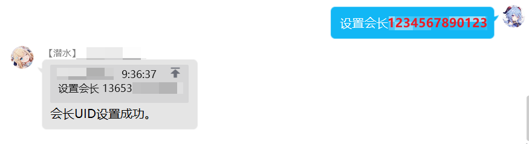

---

title: 花舞指令
# sidebar: auto
---

# 花舞指令

::: tip

本模块的功能，都由花舞组提供。

:::

## 实时攻略类
### 万用表
指令：`设置会长 <13位游戏UID>`  
示例：
```
设置会长     
```
 
权限：管理员    
说明：设置工会的会长游戏 uid 后，才能查询工会当前排名。    

***
### rank表
指令：`设置会长 <13位游戏UID>`  
示例：
```
设置会长     
```
 
权限：管理员    
说明：设置工会的会长游戏 uid 后，才能查询工会当前排名。    

***
### 半月刊
指令：`设置会长 <13位游戏UID>`  
示例：
```
设置会长     
```
 
权限：管理员    
说明：设置工会的会长游戏 uid 后，才能查询工会当前排名。    

***
### 露娜塔
指令：`设置会长 <13位游戏UID>`  
示例：
```
设置会长     
```
 
权限：管理员    
说明：设置工会的会长游戏 uid 后，才能查询工会当前排名。    

***
### 刷图推荐
指令：`设置会长 <13位游戏UID>`  
示例：
```
设置会长     
```
 
权限：管理员    
说明：设置工会的会长游戏 uid 后，才能查询工会当前排名。    

***
### 活动攻略
指令：`设置会长 <13位游戏UID>`  
示例：
```
设置会长     
```
 
权限：管理员    
说明：设置工会的会长游戏 uid 后，才能查询工会当前排名。    

***
### 实时攻略
指令：`设置会长 <13位游戏UID>`  
示例：
```
设置会长     
```
 
权限：管理员    
说明：设置工会的会长游戏 uid 后，才能查询工会当前排名。    

***
### 屯体力
指令：`设置会长 <13位游戏UID>`  
示例：
```
设置会长     
```
 
权限：管理员    
说明：设置工会的会长游戏 uid 后，才能查询工会当前排名。    

***

## 千里眼/数据类

### 专武
指令：`设置会长 <13位游戏UID>`  
示例：
```
设置会长     
```
 
权限：管理员    
说明：设置工会的会长游戏 uid 后，才能查询工会当前排名。    

***
### 千里眼
### 六星
### 图书馆
### 日程表
### 家具
### 指南
### 考古表
### 地下城

## 其他
### 测试
### 面试群
### 霸瞳活动
### 自走棋
### 抽卡
### 帮助

