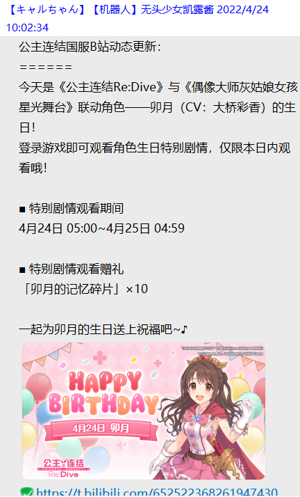

# 系统指令

## 登录
指令：`登录`    
示例：
```
登录
```
权限：无  
说明：登录进入Web模式  
***
## 帮助
指令：`帮助|help`    
示例：  
```
帮助   
help  
```    
权限：无  
说明：查看机器人使用帮助
***
## 推送功能
指令：无  
示例：

   
权限：机器人管理员 
说明：启用推送功能后，可以实时获取b站官方的新闻，如卡池更新，活动更新等~
***
